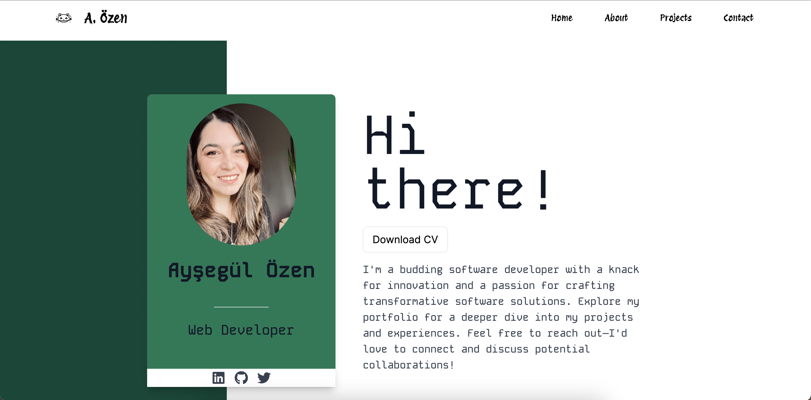
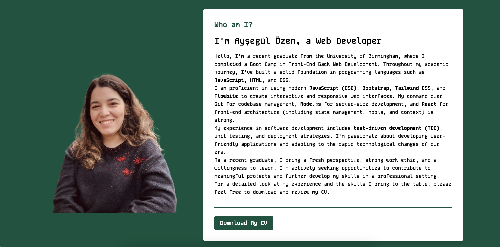
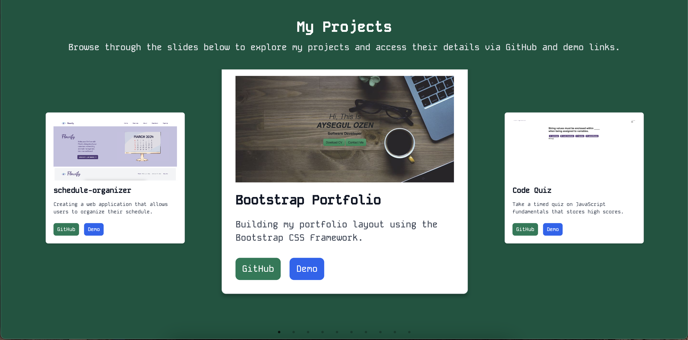
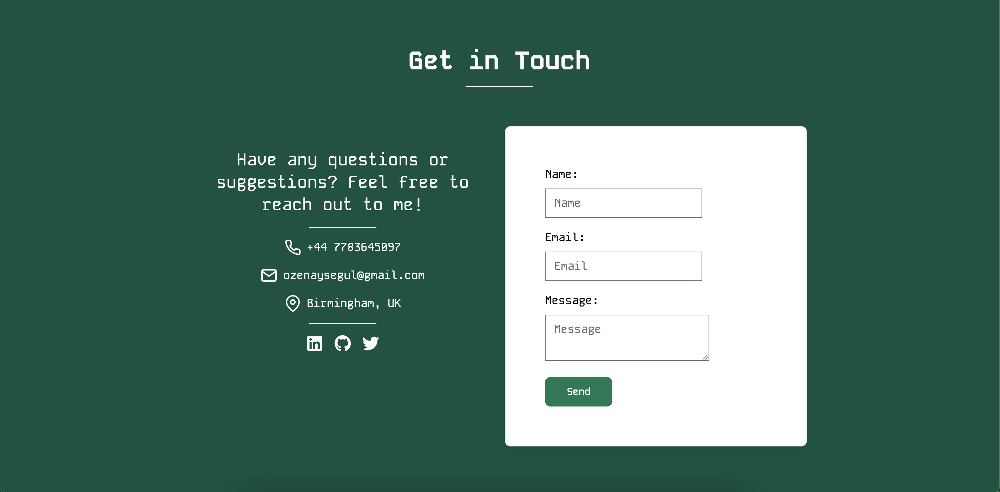

# Ayşegül Özen's Portfolio

This is the GitHub repository for my personal portfolio website, a space where I showcase my journey, skills, and projects in the field of web development. This README provides an overview of the technologies I used and my approach to building the site.

## Table of Contents

- [Overview](#overview)
- [Deployed Page](#deployed-page)
- [GitHub Repo](#github-repo)
- [Technologies Used](#technologies-used)
- [Development Process](#development-process)
- [Getting Started](#getting-started)
- [Usage](#usage)
- [License](#license)
- [Screenshots](#screenshots)
- [Live Demo](#live-demo)

## Overview

My portfolio is designed to be a reflection of my abilities and style as a developer. It features a clean, responsive design, optimized for performance and accessibility. The goal was to create an intuitive user experience while showcasing my work and providing an easy way to contact me.

## Deployed Page

[Visit Page](https://aysegulozenportfolio.netlify.app/)

## GitHub Repo

[GitHub Repo](https://github.com/Aysegulozen/React-My-Portfolio)

## Technologies Used

Building this portfolio involved a variety of technologies, carefully chosen to deliver an optimal mix of efficiency and functionality:

- **React:** A JavaScript library for building user interfaces. I used React to create a single-page application (SPA), making the site fast and smooth.
- **Tailwind CSS:** A utility-first CSS framework for rapid UI development. Tailwind CSS helped me design a custom, responsive layout without writing tons of custom CSS.
- **Flowbite React:** An open-source library of Tailwind CSS components built with React. It provided me with pre-styled components like buttons, cards, and forms, speeding up the development process.
- **EmailJS:** A service that allows sending emails directly from the frontend without needing a backend server. I used EmailJS to integrate a contact form that sends messages to my email, ensuring I'm easily reachable.
- **Vite:** A modern frontend build tool that significantly improves the development experience. Vite's fast refresh and optimized build times made development a breeze.

## Development Process

1. **Planning:** Started with sketching out the design and layout, focusing on user experience and mobile responsiveness.
2. **Setup:** Initialized the project with Vite for React to benefit from its fast builds and hot module replacement.
3. **Design Implementation:** Utilized Tailwind CSS for styling, creating a custom theme that aligns with my personal brand.
4. **Component Development:** Developed reusable React components, employing Flowbite React for standard UI elements.
5. **Contact Form Integration:** Implemented the contact form using EmailJS, allowing visitors to send messages directly to my email without server-side code.

## Getting Started

To clone and run this application locally, follow these steps:

- git clone https://github.com/Aysegulozen/React-My-Portfolio.git
- cd React-My-Portfolio
- cd my-portfolio
- npm install
- npm run dev 

## License
This project is licensed under the MIT License - see the LICENSE file for details.

## Screenshots

## live-demo
[Watch the Walkthrough Video](https://drive.google.com/file/d/1A3o1osYib5ANofD9nlKfxml82n311ku7/view?usp=sharing)